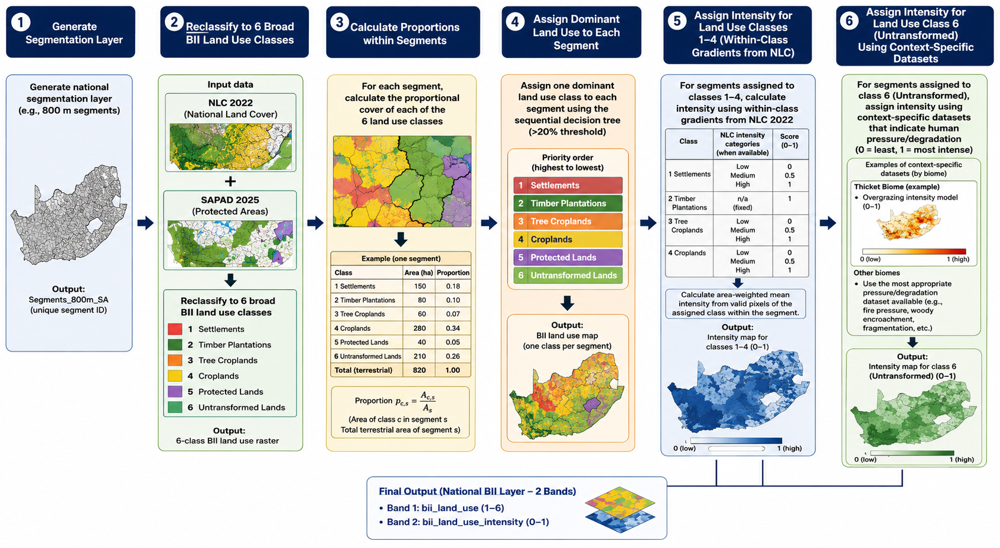

## Workflow summary

This workflow combines the South African National Land Cover (NLC) 2022, the South African National Protected Area Database (SAPAD) and biome-specific ecocsystem condition data to produce segment-based land use and land use intensity layers to develop a South African Biodiversity Intactness Index.

The unit of assessment is a spatial segment rather than an individual raster pixel. At the end of the workflow, each segment receives:

-   one dominant BII land use class; and

-   one land use intensity score between 0 and 1.

The pages are split into four sections with an additional case study:

-   [National segmentation](segmentation.qmd)

-   National [land use reclassification](land-use-reclassification.qmd)

-   National [segment land use and intensity allocation](segment-allocation.qmd)

-   Context-specific land use intensity score refinement of "untransformed"

Case study for [Thicket-specific intensity refinement](thicket-intensity.qmd)

## Current status

The worflow is setup as three GEE scripts, with data saved as GEE assets and can be updated iteratively.

-   Step 1: National segmentation tested and **completed.**

-   Step 2: NLC reclassification steps **completed**

    -   NLC classes crosswalked to BII broad land use classes

    -   SAPAD appropriate BII classes selected and cleaned

-   Step 3: Calculate proportions of broad land use classes within each segment **completed**

-   Step 4 : Assign dominant land use class using sequential decision tree **first iteration completed**

-   Step 5: Assign intensity for BII land use classes 1-4 from NLC **first iteration completed**

-   Step 6: Assign intensity for BII land class 6 (untransformed). **In progress**

-   Iteratively improve decision rules

    {alt="Provisional 6 step workflow for generation of a land use intensity layer for South Africa" width="671" height="438"}

## Next steps

-   Different datasets are now being tested as an additional source of intensity information.

-   Finalise priority of decision tree and thresholds for second iteration

-   Check broad land use class distribution in segments in R (export from GEE)

## Discussion points

-   Is intensity for timber n/a because it is high?

-   How do we quantify low, med, high? 0-1?

-   Does protected area get priority over intensity data for untransformed? E.g. Addo North is protected but was heavily overbrowsed in past

-   Should we calculate mean intensity only for pixels of the broad land use class?

-   Relativity of land use intensity

-   Confidence in NLC broad land use classes. Those not confident: additional data sources?
