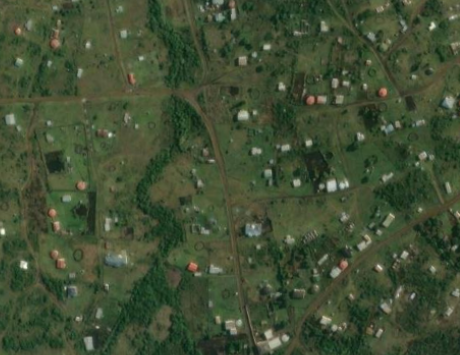
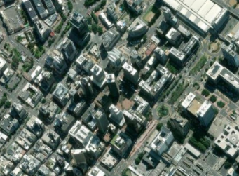
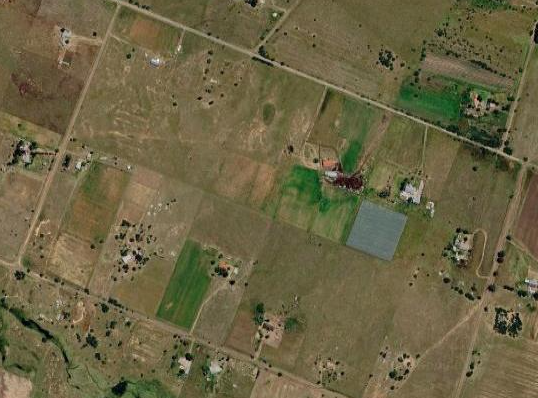
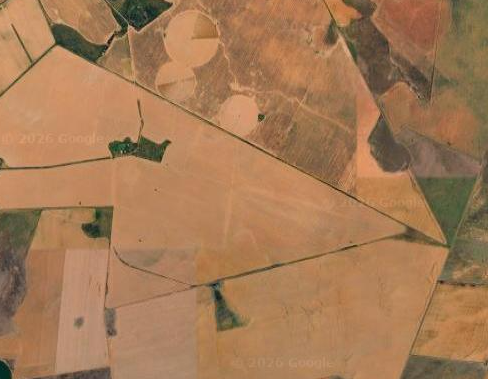
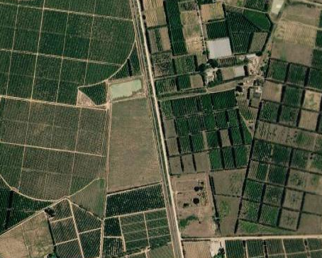
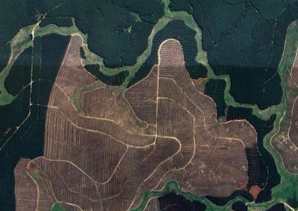

## Summary

We used the South African National Land Cover (SANLC) dataset to assign both the broad land use to each segment and estimate land use intensity because it provides a nationally consistent and high-resolution representation of land cover that was not available across sub-Saharan Africa for the original BII assessment. SANLC is already used by SANBI in the National Biodiversity Assessment and other national biodiversity monitoring applications, providing consistency with established South African biodiversity products. Its regular update cycle (approximately every four years) also means that the BII land use and intensity layers can be updated using the same underlying national dataset, supporting repeatable monitoring of changes through time.

## Linking intensity to the expert assessments

The BII experts estimated the abundance remaining for each species group under specified landscape scenarios, relative to an intact reference. For settlements, croplands and tree croplands, paired scenarios define the low- and high-intensity endpoints of an intensity gradient. Timber plantations were represented by a single intensive scenario.

For the sub-Saharan African BII, separate spatial proxies were used to estimate intensity within each broad land use. Relevant variables were standardised to 0–1, combined with equal weights, and rescaled within each broad land use class. For example, settlement intensity used settlement extent and population density, while cropland intensity used crop cover, field size and nitrogen inputs.

The South African implementation differs slightly because the 73-class SANLC product provides substantially more detailed information on the composition of each landscape. We use those subclasses to represent the **within-class intensity** of the land use assigned to a segment, while also explicitly accounting for the **proportion of the segment converted to any non-natural land use**.

### 

### SANLC intensity crosswalk

For transparency, the SANLC subclasses used to characterise within-class land use intensity were assigned to low, medium and high intensity categories and converted to scores of 0, 0.5 and 1, respectively. Timber plantations were treated as a single high-intensity class with a fixed score of 1.

| Broad BII land use | SANLC subclass                                       | Intensity category | Score |
|-----------------|-----------------|------------------:|------------------:|
| Timber plantations | contiguous & dense plantation forest                 |               high |     1 |
| Timber plantations | open & sparse plantation forest                      |               high |     1 |
| Timber plantations | temporary unplanted (clear-felled) plantation forest |               high |     1 |
| Tree croplands     | cultivated commercial permanent orchards             |               high |     1 |
| Tree croplands     | cultivated commercial permanent vines                |               high |     1 |
| Croplands          | cultivated commercial sugarcane pivot irrigated      |               high |     1 |
| Croplands          | cultivated commercial permanent pineapples           |               high |     1 |
| Croplands          | cultivated commercial sugarcane non-pivot            |               high |     1 |
| Croplands          | cultivated emerging farmer sugarcane non-pivot       |               high |     1 |
| Croplands          | commercial annual crops pivot irrigated              |               high |     1 |
| Croplands          | commercial annual crops non-pivot irrigated          |               high |     1 |
| Croplands          | commercial annual crops rain-fed / dryland           |               high |     1 |
| Croplands          | subsistence / small-scale annual crops               |                low |     0 |
| Croplands          | smallholdings (tree)                                 |                low |     0 |
| Croplands          | smallholdings (bush)                                 |                low |     0 |
| Croplands          | smallholdings (low veg / grass)                      |                low |     0 |
| Croplands          | smallholdings (bare)                                 |                low |     0 |
| Settlements        | residential formal (tree)                            |             medium |   0.5 |
| Settlements        | residential formal (bush)                            |             medium |   0.5 |
| Settlements        | residential formal (low veg / grass)                 |             medium |   0.5 |
| Settlements        | residential formal (bare)                            |               high |     1 |
| Settlements        | residential informal (tree)                          |             medium |   0.5 |
| Settlements        | residential informal (bush)                          |             medium |   0.5 |
| Settlements        | residential informal (low veg / grass)               |             medium |   0.5 |
| Settlements        | residential informal (bare)                          |               high |     1 |
| Settlements        | village scattered (bare & low veg/ grass combo)      |             medium |   0.5 |
| Settlements        | village dense (bare & low veg / grass combo)         |             medium |   0.5 |
| Settlements        | urban recreational fields (tree)                     |                low |     0 |
| Settlements        | urban recreational fields (bush)                     |                low |     0 |
| Settlements        | urban recreational fields (grass)                    |                low |     0 |
| Settlements        | urban recreational fields (bare)                     |                low |     0 |
| Settlements        | commercial                                           |               high |     1 |
| Settlements        | industrial                                           |               high |     1 |
| Settlements        | roads & rails (major linear)                         |               high |     1 |
| Settlements        | mines: surface infrastructure                        |               high |     1 |
| Settlements        | mines: extraction pits, quarries                     |               high |     1 |
| Settlements        | mines: salt mines                                    |               high |     1 |
| Settlements        | mine: tailings and resource dumps                    |               high |     1 |
| Settlements        | land-fills                                           |               high |     1 |

These scores represent relative intensity within each broad land use class, rather than a common ecological impact scale across all classes. The final segment-level intensity for non-natural classes is therefore obtained by averaging the assigned-class mean intensity with the total proportion of the terrestrial segment occupied by all non-natural land uses.

### Segment intensity calculation

For settlements, croplands and tree croplands, SANLC subclasses are assigned provisional intensity scores:

| Intensity class | Score |
|-----------------|------:|
| Low             |     0 |
| Medium          |   0.5 |
| High            |     1 |

For each segment, the first component is the area-weighted mean intensity of SANLC pixels belonging to the **broad land use assigned to that segment**:

$$
\bar{I}_{c,s}
=
\frac{\sum_i a_i I_i}
     {\sum_i a_i}
$$

where:

-   $\bar{I}_{c,s}$ is the mean subclass intensity for assigned class $c$ in segment $s$;
-   $I_i$ is the intensity score of pixel $i$;
-   $a_i$ is its area; and
-   only valid pixels belonging to the assigned broad land use are included.

The second component is the proportion of the terrestrial segment covered by **all non-natural BII land uses combined**:

$$
P_{\mathrm{non-natural},s}
=
P_{\mathrm{settlement},s}
+
P_{\mathrm{timber},s}
+
P_{\mathrm{treecrop},s}
+
P_{\mathrm{cropland},s}
$$

The final segment intensity for settlements, tree croplands and croplands is:

$$
I_s =
\frac{
\bar{I}_{c,s}
+
P_{\mathrm{non-natural},s}
}{2}
$$

This gives equal weight to:

1.  **how intensive the assigned land use is**, based on its detailed SANLC subclasses; and
2.  **how much of the surrounding segment has been converted away from intact land**.

For example, if a settlement-assigned segment has a mean settlement intensity of 0.8 and 90% of its terrestrial area is covered by settlements, croplands, tree croplands or timber plantations, its final intensity is:

$$
I_s = \frac{0.8 + 0.9}{2} = 0.85
$$

This allows two segments assigned to the same broad land use to differ not only because their mapped subclasses differ, but also because one occurs in a more extensively transformed landscape.

### Timber plantations

Timber plantations are treated separately because the BII expert elicitation used a single plantation scenario rather than a low-to-high plantation gradient. Their assigned-class intensity is therefore fixed at **1**.

The segment-level intensity is still adjusted for the total amount of non-natural land:

$$
I_s =
\frac{
1
+
P_{\mathrm{non-natural},s}
}{2}
$$

Thus, a timber-assigned segment that is 80% non-natural receives an intensity of 0.9.

### Protected lands

Protected lands are currently assigned an intensity of **0**. Protected status is treated as a management designation rather than part of the non-natural proportion.

This value represents the low-pressure protected scenario used in the BII land use framework and should not be interpreted as a direct measurement of protected-area effectiveness or ecological condition.

### Untransformed lands

**In progress**

Intensity for segments assigned to Untransformed lands will be calculated separately. The land use intensity of land that has not been converted cannot be inferred reliably from SANLC natural cover subclasses alone because natural vegetation may still experience substantial grazing, browsing, harvesting or other land use pressures.

The sub-Saharan BII estimated intensity in untransformed lands primarily from livestock density and nitrogen inputs, with livestock pressure standardised within rainfall and soil nutrient contexts. For the South African implementation, additional pressure and condition datasets can be used where they improve on these broad proxies.

Potential inputs include livestock pressure relative to carrying capacity and mapped degradation or condition products being developed at SANBI. For example, in the Thicket biome, remotely sensed estimates of intact, moderately degraded and severely degraded vegetation could help distinguish rangeland use intensity within segments otherwise classified as untransformed.

This component will be developed separately so that transformation intensity in the four non-natural classes is not conflated with ecological pressure or degradation in remaining natural vegetation.

## Class-specific implementation

### Settlements

**Endpoints: mixed settlements → dense urban.**

{width="278"}{width="290"}

The South African approach uses SANLC settlement subclasses to distinguish within-class intensity. Vegetated formal and informal residential areas and villages are assigned intermediate scores, highly transformed residential, commercial, industrial, transport and mining classes are assigned high scores, and urban recreational classes are assigned low scores.

The mean settlement score is then averaged with the total non-natural proportion of the segment.

### Croplands

**Endpoints: non-intensive smallholder croplands → intensive large-scale croplands.**

{width="239"}

{width="226"}

Commercial annual crops, sugarcane and other intensive commercial crop classes are assigned high intensity. Subsistence/small-scale annual crops and SANLC smallholding classes are assigned to the Croplands broad class at low intensity, reflecting the non-intensive smallholder endpoint more closely.

The mean cropland score is then averaged with the total non-natural proportion of the segment.

### Tree croplands

**Endpoints: non-intensive smallholder croplands → tree-crop plantations.**

{width="246"}

Commercial orchards and vines are currently assigned high intensity. Their mean assigned-class intensity is averaged with the total non-natural proportion of the segment.

### Timber plantations

**Single scenario: timber plantations.**

{width="242"}

All plantation subclasses are treated as the single intensive plantation scenario. Their assigned-class intensity is fixed at 1 and averaged with the total non-natural proportion.

## Difference from the sub-Saharan BII approach

The two approaches share the same conceptual aim: representing the intensity of human land use at a landscape scale so that mapped land uses correspond as closely as possible to the scenarios assessed by experts.

The main difference is how intensity is "spatialised".

The **sub-Saharan BII** relied on separate pressure proxies such as population density, mapped land use extent, field size, nitrogen inputs and livestock density. These variables were standardised and combined to produce a relative intensity score within each broad class.

The **South African BII** makes greater use of the detailed SANLC classification. The intensity of the assigned class is first estimated from its mapped subclasses and then combined with the total proportion of the segment occupied by non-natural land uses. This explicitly incorporates landscape transformation into the segment score and reduces the dependence on separate continental-scale intensity proxies where detailed national land-cover information is available.

The approach remains consistent with the landscape-scale interpretation of the expert elicitation: intensity is intended to characterise the overall human modification represented by a segment, rather than the condition of an isolated land-cover pixel.
