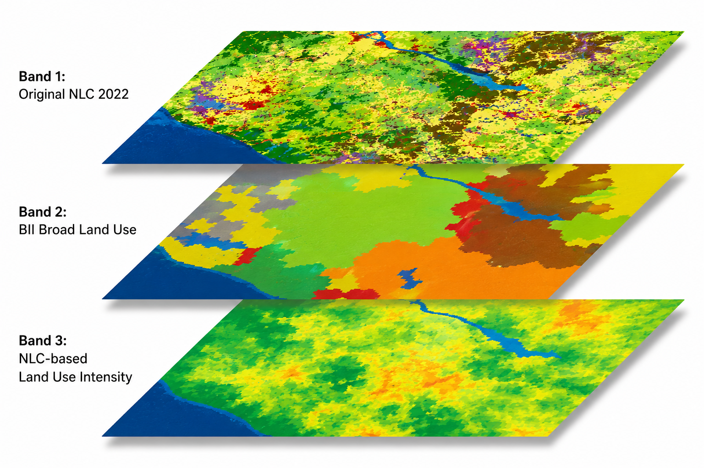

## To do 29 July 2026

-   Ensure secondary natural merged correctly from NLC 7 class to the NLC 72 class

## Summary

The NLC 2022 data were reclassified into broad land use classes required by the BII workflow [@clements2026]. A second band records the available low, medium or high intensity class associated with the original NLC category.

## Input data

-   NLC 2022
-   NLC 7 class data (to extract secondary natural)
-   A BII reclassification table linking each NLC class to:
    1.  a broad BII land use class; and
    2.  selected intensity class for each NLC class

The NLC thus is used for 2 classification frameworks: 1. broad land use classes and 2. the broad level classes' intensity gradients. The protected areas class is added later during segment allocation using the SAPAD layer.

## Data preparation

The original NLC classes (for details see [#nlclooklup](#nlclooklup)) were grouped into six broad BII land use categories. Detailed descriptions of BII land use classes are available in [Supplementary Table 2](https://www.nature.com/articles/s41597-023-02832-6#Sec11) in Clements et al. (2024).

| Value | BII broad land use |
|------:|--------------------|
|     1 | Settlements        |
|     2 | Timber plantations |
|     3 | Tree crops         |
|     4 | Croplands          |
|     5 | Protected          |
|     6 | Untransformed      |

Waterbodies were excluded to retain only terrestrial land cover.

The preliminary intensity classes that could be identified from the NLC 2022 were retained in a second band as:

| Raster value | Intensity class          |
|-------------:|--------------------------|
|            0 | No within class gradient |
|            1 | Unknown                  |
|            2 | Low                      |
|            3 | Medium                   |
|            4 | High                     |

## Analysis

Script: <https://code.earthengine.google.com/6958a52908d318de493032cd5dbdd59d>

Each NLC class was assigned a broad BII land use value in GEE. Where we were able to distinguish BII within-class intensity from NLC classes, it was also assigned a low, medium or high intensity class in this step. The original NLC 2022 value was retained in `sanlc_class` for traceability.

The resulting raster dataset contains three bands:

``` text
bii_land_use
bii_intensity_class
sanlc_class
```

{width="513"}

## Detailed NLC reclassification and intensity lookup

The table below records the current preliminary assignment for every NLC class:

-   `low`, `medium` and `high` are implemented as 0, 0.5 and 1 for the first iteration;
-   `unknown` means that intensity has not yet been assigned from NLC alone, and needs supplementary data;
-   `n/a` means that a separate class-level rule is used or the class is excluded in the BII broad land use classes.

::: {#nlclooklup .callout-note collapse="true"}
## Complete NLC lookup table

| NLC code | NLC class                                            | BII land use        | NLC-based intensity | Current numeric treatment | Notes                                                                                                                       |
|---------:|------------------------------------------------------|---------------------|---------------------|---------------------------|-----------------------------------------------------------------------------------------------------------------------------|
|        1 | contiguous (indigenous) forest                       | Untransformed lands | unknown             | Not yet assigned          | some likely to be degraded                                                                                                  |
|        2 | contiguous low forest & thicket                      | Untransformed lands | unknown             | Not yet assigned          | some likely to be degraded                                                                                                  |
|        3 | dense forest & woodland                              | Untransformed lands | unknown             | Not yet assigned          | some likely to be degraded                                                                                                  |
|        4 | open woodland                                        | Untransformed lands | unknown             | Not yet assigned          | some likely to be degraded                                                                                                  |
|        5 | contiguous & dense plantation forest                 | Timber plantations  | n/a                 | 1, fixed by class         | some likely to be degraded                                                                                                  |
|        6 | open & sparse plantation forest                      | Timber plantations  | n/a                 | 1, fixed by class         | some likely to be degraded                                                                                                  |
|        7 | temporary unplanted (clear-felled) plantation forest | Timber plantations  | n/a                 | 1, fixed by class         | some likely to be degraded                                                                                                  |
|        8 | low shrubland (other)                                | Untransformed lands | unknown             | Not yet assigned          | some likely to be degraded                                                                                                  |
|        9 | low shrubland (fynbos)                               | Untransformed lands | unknown             | Not yet assigned          | some likely to be degraded                                                                                                  |
|       10 | low shrubland (succulent karoo)                      | Untransformed lands | unknown             | Not yet assigned          | some likely to be degraded                                                                                                  |
|       11 | low shrubland (nama karoo)                           | Untransformed lands | unknown             | Not yet assigned          | some likely to be degraded                                                                                                  |
|       12 | sparsely wooded grassland                            | Untransformed lands | unknown             | Not yet assigned          | some likely to be degraded                                                                                                  |
|       13 | natural grassland                                    | Untransformed lands | unknown             | Not yet assigned          | some likely to be degraded                                                                                                  |
|       14 | natural rivers                                       | Exclude             | n/a                 | Excluded                  | water excluded                                                                                                              |
|       15 | natural estuaries & lagoons                          | Exclude             | n/a                 | Excluded                  | water excluded                                                                                                              |
|       16 | natural ocean & coastal                              | Exclude             | n/a                 | Excluded                  | water excluded                                                                                                              |
|       17 | natural lakes                                        | Exclude             | n/a                 | Excluded                  | water excluded                                                                                                              |
|       18 | natural pans (flooded at observation times)          | Exclude             | n/a                 | Excluded                  | water excluded                                                                                                              |
|       19 | artificial dams, including canals                    | Exclude             | n/a                 | Excluded                  | water excluded                                                                                                              |
|       20 | artificial sewage ponds                              | Exclude             | n/a                 | Excluded                  | water excluded                                                                                                              |
|       21 | artificial flooded mine pits                         | Exclude             | n/a                 | Excluded                  | water excluded                                                                                                              |
|       22 | herbaceous wetlands, currently mapped                | Untransformed lands | unknown             | Not yet assigned          | some likely to be degraded                                                                                                  |
|       23 | herbaceous wetlands, previously mapped               | Untransformed lands | unknown             | Not yet assigned          | some likely to be degraded                                                                                                  |
|       24 | mangrove wetlands                                    | Untransformed lands | unknown             | Not yet assigned          | some likely to be degraded                                                                                                  |
|       25 | natural rock surfaces                                | Untransformed lands | unknown             | Not yet assigned          | some likely to be degraded                                                                                                  |
|       26 | dry pans                                             | Untransformed lands | unknown             | Not yet assigned          | some likely to be degraded                                                                                                  |
|       27 | eroded lands                                         | Untransformed lands | high                | 1                         | Less than 1% of the country; intended to represent severe erosion                                                           |
|       28 | sand dunes, terrestrial                              | Untransformed lands | unknown             | Not yet assigned          | some likely to be degraded                                                                                                  |
|       29 | coastal sand and dunes                               | Untransformed lands | unknown             | Not yet assigned          | some likely to be degraded                                                                                                  |
|       30 | bare riverbed material                               | Untransformed lands | unknown             | Not yet assigned          | some likely to be degraded                                                                                                  |
|       31 | other bare                                           | Untransformed lands | unknown             | Not yet assigned          | some likely to be degraded                                                                                                  |
|       32 | cultivated commercial permanent orchards             | Tree croplands      | high                | 1                         |                                                                                                                             |
|       33 | cultivated commercial permanent vines                | Tree croplands      | high                | 1                         |                                                                                                                             |
|       34 | cultivated commercial sugarcane pivot irrigated      | Croplands           | high                | 1                         |                                                                                                                             |
|       35 | cultivated commercial permanent pineapples           | Croplands           | high                | 1                         |                                                                                                                             |
|       36 | cultivated commercial sugarcane non-pivot            | Croplands           | high                | 1                         |                                                                                                                             |
|       37 | cultivated emerging farmer sugarcane non-pivot       | Croplands           | high                | 1                         |                                                                                                                             |
|       38 | commercial annual crops pivot irrigated              | Croplands           | high                | 1                         |                                                                                                                             |
|       39 | commercial annual crops non-pivot irrigated          | Croplands           | high                | 1                         |                                                                                                                             |
|       40 | commercial annual crops rain-fed or dryland          | Croplands           | high                | 1                         |                                                                                                                             |
|       41 | subsistence or small-scale annual crops              | Croplands           | low                 | 0                         |                                                                                                                             |
|       42 | fallow land and old fields, trees                    | Untransformed lands | high                | 1, provisional            | Assumed degraded because it was formerly cropland                                                                           |
|       43 | fallow land and old fields, bush                     | Untransformed lands | high                | 1, provisional            | Assumed degraded because it was formerly cropland                                                                           |
|       44 | fallow land and old fields, grass                    | Untransformed lands | high                | 1, provisional            | Assumed degraded because it was formerly cropland                                                                           |
|       45 | fallow land and old fields, bare                     | Untransformed lands | high                | 1                         | Assumed degraded because it was formerly cropland and is currently bare                                                     |
|       46 | fallow land and old fields, low shrub                | Untransformed lands | high                | 1, provisional            | Assumed degraded because it was formerly cropland                                                                           |
|       47 | residential formal, tree                             | Settlements         | medium              | 0.5                       |                                                                                                                             |
|       48 | residential formal, bush                             | Settlements         | medium              | 0.5                       |                                                                                                                             |
|       49 | residential formal, low vegetation or grass          | Settlements         | medium              | 0.5                       |                                                                                                                             |
|       50 | residential formal, bare                             | Settlements         | high                | 1                         |                                                                                                                             |
|       51 | residential informal, tree                           | Settlements         | medium              | 0.5                       |                                                                                                                             |
|       52 | residential informal, bush                           | Settlements         | medium              | 0.5                       |                                                                                                                             |
|       53 | residential informal, low vegetation or grass        | Settlements         | medium              | 0.5                       |                                                                                                                             |
|       54 | residential informal, bare                           | Settlements         | high                | 1                         |                                                                                                                             |
|       55 | village scattered, bare and low vegetation or grass  | Settlements         | low                 | 0                         |                                                                                                                             |
|       56 | village dense, bare and low vegetation or grass      | Settlements         | low                 | 0                         |                                                                                                                             |
|       57 | smallholdings, tree                                  | Settlements         | low                 | 0                         | Could also represent low-intensity agriculture, but agriculture is not always present and the class is generally peri-urban |
|       58 | smallholdings, bush                                  | Settlements         | low                 | 0                         | Could also represent low-intensity agriculture, but agriculture is not always present and the class is generally peri-urban |
|       59 | smallholdings, low vegetation or grass               | Settlements         | low                 | 0                         | Could also represent low-intensity agriculture, but agriculture is not always present and the class is generally peri-urban |
|       60 | smallholdings, bare                                  | Settlements         | low                 | 0                         | Could also represent low-intensity agriculture, but agriculture is not always present and the class is generally peri-urban |
|       61 | urban recreational fields, tree                      | Settlements         | low                 | 0                         |                                                                                                                             |
|       62 | urban recreational fields, bush                      | Settlements         | low                 | 0                         |                                                                                                                             |
|       63 | urban recreational fields, grass                     | Settlements         | low                 | 0                         |                                                                                                                             |
|       64 | urban recreational fields, bare                      | Settlements         | low                 | 0                         |                                                                                                                             |
|       65 | commercial                                           | Settlements         | high                | 1                         |                                                                                                                             |
|       66 | industrial                                           | Settlements         | high                | 1                         |                                                                                                                             |
|       67 | roads and rails, major linear features               | Settlements         | high                | 1                         |                                                                                                                             |
|       68 | mines: surface infrastructure                        | Settlements         | high                | 1                         |                                                                                                                             |
|       69 | mines: extraction pits and quarries                  | Settlements         | high                | 1                         |                                                                                                                             |
|       70 | mines: salt mines                                    | Settlements         | high                | 1                         |                                                                                                                             |
|       71 | mines: tailings and resource dumps                   | Settlements         | high                | 1                         |                                                                                                                             |
|       72 | landfills                                            | Settlements         | high                | 1                         |                                                                                                                             |
|       73 | fallow land and old fields, wetlands                 | Untransformed lands | high                | 1, provisional            | Assumed degraded because it was formerly cropland                                                                           |
:::

## 
