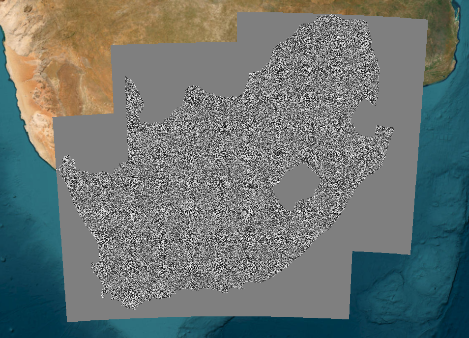

## Rationale

A national segmentation layer was created to provide the spatial unit of assessment for the BII land use and intensity layers. Regular grid cells impose artificial boundaries on the landscape and frequently contain mixtures of land uses, particularly in heterogeneous landscapes, which can obscure the ecological meaning of assigned classes. In contrast, segmentation groups pixels into spatially contiguous units based on similarity, producing units that more closely align with underlying vegetation structure, land use patterns, and management units. BII land use classes are intended to represent landscape-scale land use contexts linked to species responses, rather than individual pixels. Defining analysis units that better reflect real-world landscape “organisation” therefore improves the ecological interpretability of land use classification and provides a more appropriate basis for assigning land use intensity and estimating biodiversity intactness.

## Input data

-   Alpha Earth annual satellite embeddings[@brown].

-   Land and water masks used to restrict the analysis.

## Parameter selecetion and analysis

Segmentation was implemented in Google Earth Engine using the Simple Non-Iterative Clustering algorithm ([SNIC,or superpixel clustering](https://developers.google.com/earth-engine/apidocs/ee-algorithms-image-segmentation-snic)) applied to the [AlphaEarth Foundations Embeddings](https://arxiv.org/abs/2507.22291) (Brown et al., 2025). The embeddings provide a condensed representation of landscape characteristics derived from multiple sensors and environmental variables, including optical reflectance (e.g. Sentinel-2, Landsat 8 & 9), radar backscatter (e.g. Sentinel-1, PALSAR-2 and GEDI), climate (e.g. ERA5-Land), land cover context (NLCD), and topographic (GLO-30 DEM) information. Rather than representing a single spectral index or satellite band, each embedding dimension, of which there are 64, captures complex spatial, spectral and temporal patterns learned from large volumes of EO data.  So, instead of asking do these pixels have similar spectral values, it asks do these pixels have similar embedding signatures or landscape “fingerprints” (vegetation, soil, topography etc.)?

The key parameter: “**size**” controls how large each segment is, with smaller values producing numerous small, detailed segments and larger values producing fewer, larger segments that represent broader landscape units. The "**compactness"** parameter controls whether segments follow natural patterns in the data (low values, more irregular and realistic shapes) or form more regular, uniform shapes (high values). This was set to 1 to allow segments to follow natural landscape boundaries while maintaining some spatial regularity. "**Connectivit**y" controls how pixels are considered connected, where 8 allows diagonal connections (on top of the 4 direct neighbours) and results in smoother, more continuous segments. We tested three sizes: fine (size = 15; *c.* 150 m), medium (size = 40; *c.* 400 m), and coarse (size = 100; *c.* 1 km), to evaluate how segment size influences the representation of landscape heterogeneity and land-use systems. Smaller segments captured fine-scale variation such as field boundaries and patchy vegetation but over-fragmented the landscape (e.g. detect small mosaiced plant communities within a wetland), whereas larger segments represented broader land-use systems but merged some distinct land uses (different crops). An intermediate scale (800m) was selected for further analysis as it best balanced ecological realism and spatial coherence. The neighbourhood size was scaled proportionally to segment size (size × 4) to ensure stable region growth and minimise edge artefacts. Projection and scale were fixed before segmentation to reduce zoom-dependent behaviour in GEE visualisation and to improve reproducibility of the exported outputs.

The segmentation was generated once for the national extent and saved as a reusable asset. The same segment identifiers are used for all subsequent land use proportion and intensity calculations.

## Output

Google Earth Engine asset:

``` text
Segments_800m_SA
```

The raster contains an integer identifier for each segment. This identifier is used in subsequent calculations.


